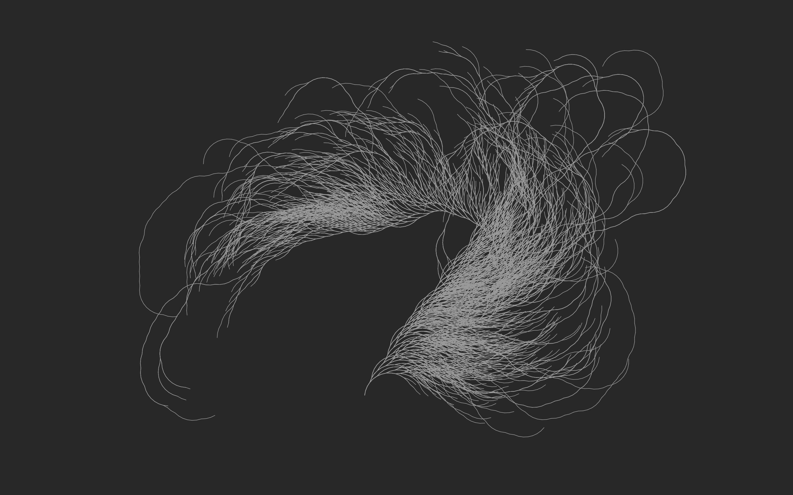
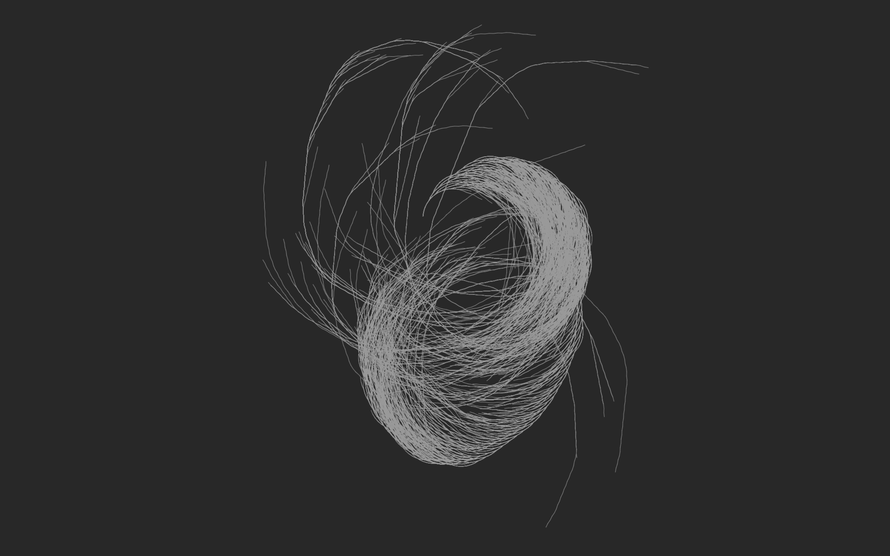

# p5.js Exploration

Tests and Exploration of the p5.js Framework

## Collatz Conjecture

Recursion on n:
- Divide by 2 if n is even
- Multiply by 3 and add 1 if n is odd
- Repeat

The Collatz Conjecture (unproved yet) says that this recursion always lead to 1. This is a visualisation of the process for all starting point in [1,10000].

